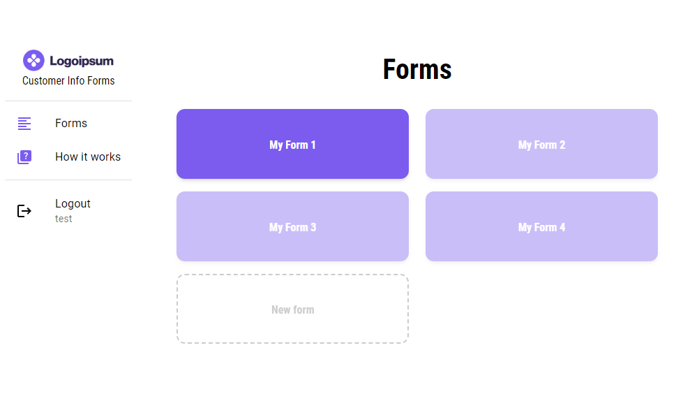

# Customer info forms - Gather customer info

## Description

I started this project after a request from my current job. They needed to gather customer information and input this in their system. They previously used a paper and pen method and did the inserting manually into the system. With this form website the customer can enter their details on a pad and the answer will appear on another device (PC, phone etc). The information can than easily be copy / pasted with a one click copy solution. The form inputs can be controlled, the language of the form can be switched and the answers can show in both uppercase or lowercase letters. Feel free to try out on the test user provided below.

- Login page
- Form page
- Customer form
- Answers Page

`Username: test`\
`Password: 123456`

## Built With

- React.js
- SCSS
- Material UI
- Axios
- Strapi CMS
- YUP
- Spring Animations
- Adobe XD

## Getting Started

### Installing

1. Clone the repo:
   `git clone https://github.com/glennlarsen/customer-info-forms.git`
   Clones the repo to your choosen destination.

2. Install the dependencies:
   `npm install`
   Install's all the required dependencies to run the project.

### Running

`npm run start`
Runs the app in the development mode.\
Open [http://localhost:3000](http://localhost:3000) to view it in your browser.

### Test Login

`User: test`\
`Password: 123456`\
Test user login to enter the Test side.

### Live Site

The website is deployed on netlify by using `npm run build` and add the build folder to the deploy section on Netlify.
[Link to live site](https://ubiquitous-bombolone-37e3ed.netlify.app/)

## Contributing

Contributions to the project are very much appreaciated. To contribute please open a pull request so the code can be reviewed.

## Contact

[My LinkedIn Page](https://www.linkedin.com/in/glenn-larsen-288173242/)\
[My Portfolio](https://glennportfolio.site)
